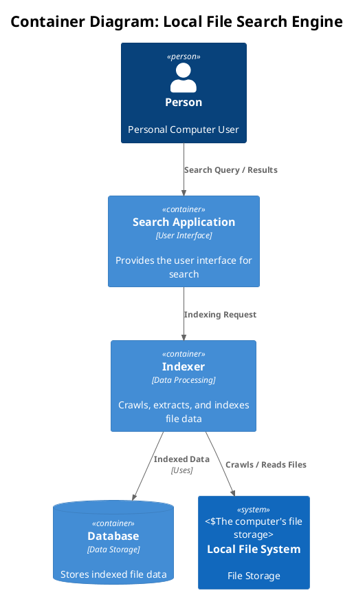
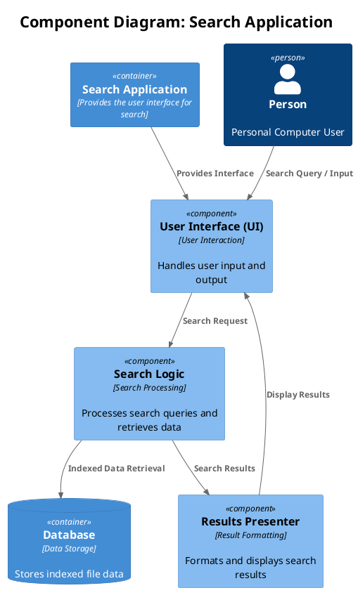

# ARCHITECTURE.md: Local File Search Engine Architecture

This document outlines the software architecture for the local file search engine using the C4 model.

## 1. Introduction

The C4 model is a hierarchical way to visualize the static structures of a software system. It consists of four levels: System Context, Containers, Components, and Classes. This document describes the architecture of the local file search engine up to the component level.

## 2. System Context Diagram

The System Context diagram provides a high-level overview of the system and its interactions with users and other systems.

### 2.1 Diagram

```plantuml
@startuml C4_Elements
!include https://raw.githubusercontent.com/plantuml-stdlib/C4-PlantUML/master/C4_Container.puml

Person(userAlias, "Person", "Personal Computer User")
Container(containerAlias, "Local File Search Engine", "System", "Shows the user files from computer based on his search")
System(systemAlias, "Local File System", "All the files from the computer")

Rel(userAlias, containerAlias, "Searches for Files")
Rel(containerAlias, systemAlias, "Retrieves Files From")

title System Context Diagram: Local File Search Engine
@enduml
```

### 2.2 Explanation

**User:**

* Represents the person who uses the local file search engine to find files on their computer.

**Local File Search Engine:**

* The software system being developed, responsible for indexing and searching files.

**Local File System:**

* Represents the user's computer's file system, where the files are stored.

**Relationships:**

* The User searches files using the Local File Search Engine.
* The Local File Search Engine accesses the Local File System to index and search files.

## 3. Container Diagram

The Container diagram illustrates the high-level technology choices and how responsibilities are distributed across the system.  A container is a separately deployable unit that executes code or stores data.



### 3.2 Explanation

**Search Application:**
This container provides the user interface for interacting with the search engine.
It handles search queries and displays results.

**Indexer:**
This container is responsible for crawling the local file system, extracting data from files, and storing it in the database.

**Database:**
This container stores the indexed data, enabling efficient searching.

**Local File System:**
This represents the file system where the files to be searched are located.

**Relationships:**

* The User interacts with the Search Application to enter search queries and view results.
* The Search Application sends indexing requests to the Indexer.
* The Indexer writes indexed data to the Database.
* The Indexer accesses the Local File System to crawl and read files.

## 4. Component Diagram: Search Application

The Component diagram zooms into a specific container and shows its major structural building blocks and their interactions. This diagram starts reflecting the code structure.



### 4.2 Explanation

**User Interface (UI):**
    This component handles user input, displays search results, and provides the overall user experience.

**Search Logic:**
    This component processes search queries, retrieves relevant data from the database, and ranks the results.

**Results Presenter:**
    This component formats the search results for display to the user, including file previews.

**Relationships:**

* The User interacts with the UI to provide search queries.
* The UI sends search requests to the Search Logic component.
* The Search Logic component interacts with the Database (a separate container) to retrieve indexed data.
* The Search Logic component sends search results to the Results Presenter.
* The Results Presenter formats and displays the results through the UI.
